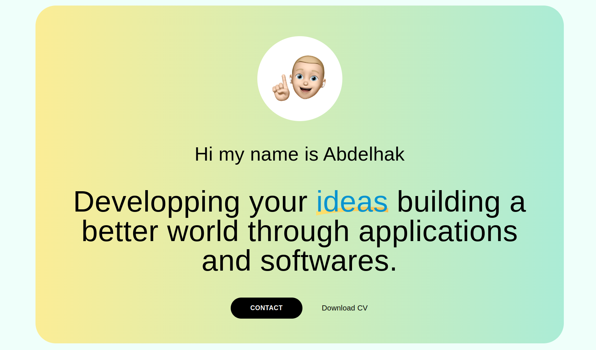
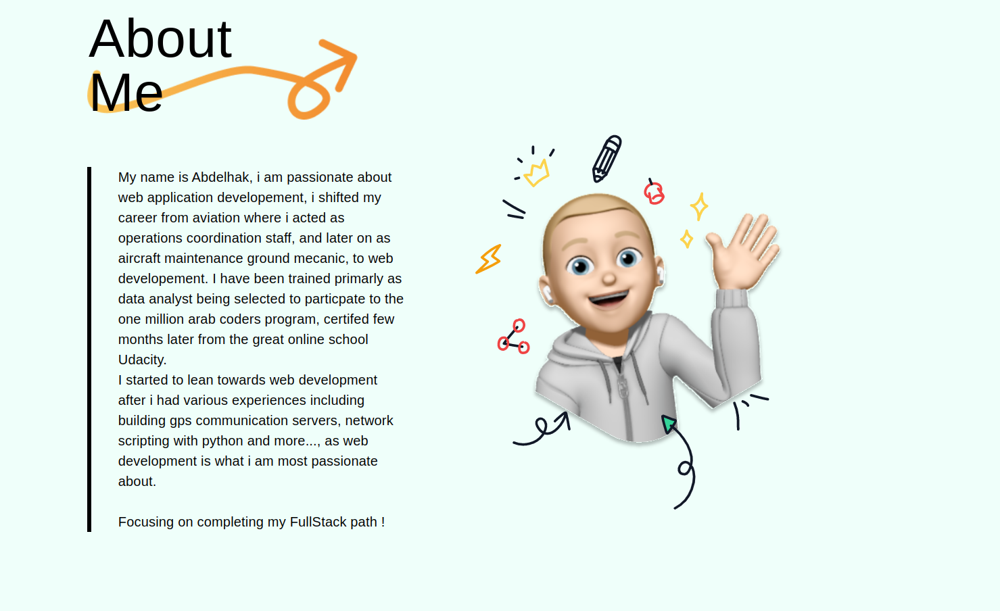

## Getting Started

First clone the project to your local machine

```bash
git clone https://github.com/a-nasseur/portfolio.git
```

Then install required dependencies by running the command below in the root of the project

```bash
npm install
```

Start your development server:

```bash
npm run dev
# or
yarn dev
```

Open [http://localhost:3000](http://localhost:3000) with your browser to see the result.

You can start editing the page by modifying `pages/index.js`. The page auto-updates as you edit the file.

## On the project

Personal portfolio based on a figma design by artist [@rafo](https://www.figma.com/@rafo "figma artist"), build from scratch using material ui @emotion library and deployed on vercel on this link [portfolio](https://portfolio-a-nasseur.vercel.app/ "my portfolio")

## Screenshots

#



#



## Foot Note

> This poject is under MIT licence terms to be used soly under the latter conditions
